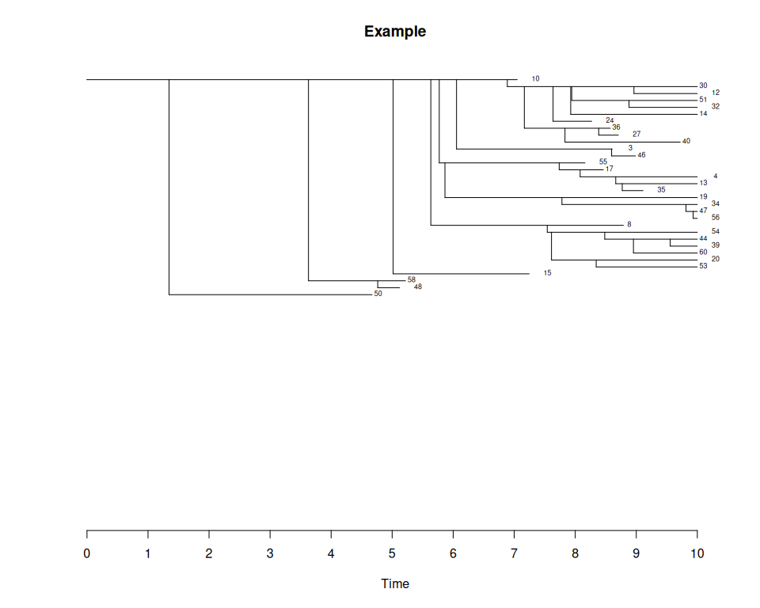
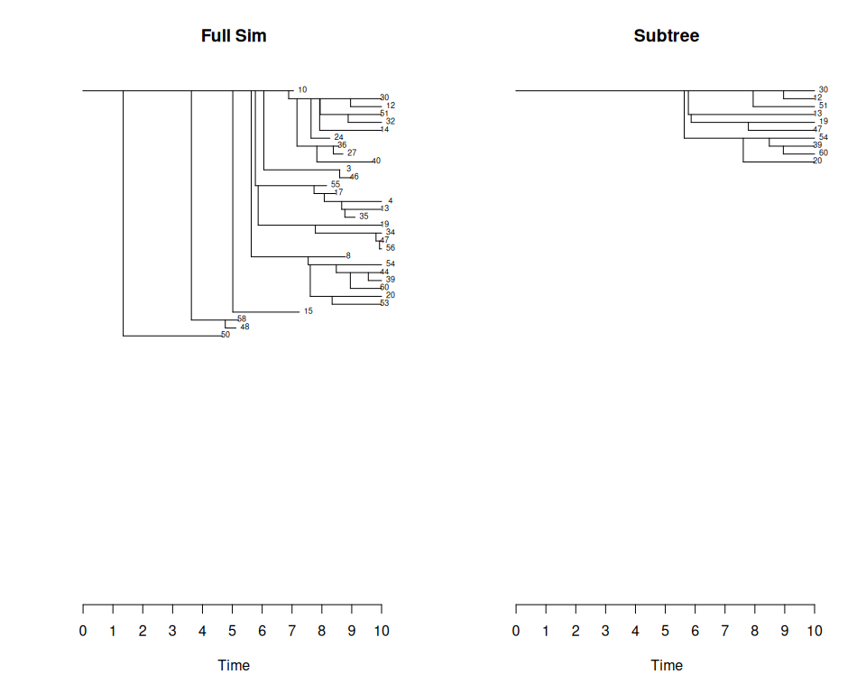

**PhyloInfect**
================

``` r
source("~/PhyloInfect.R")
source("~/Subtree.R")
set.seed(1)
```

## **Overview**

PhyloInfect is a new way to display the phylogeny of how a virus spreads
with an emphasis on who infected who.  
This package provides two main functions. Graphing the phylogeny of a
virus simulation and generating a subtree of a simulation.

## **Data**

It is essential that your simulation information is stored in a data
frame in the following format.  
**Phylogeny function is meant for population sizes of 60 or less**  
This is for readability.

#### Column Info:

##### time:

**class:** numeric, **type:** double  
stores times of events in chronological order, starting from 0.  
events include both infections and recoveries

##### infector:

**class:** list, **type:** list  
stores id’s of individuals who are infecting others or recovering.  
\*except for first row

##### affected:

**class:** list, **type:** list  
stores id’s of individuals who are getting infected or 0 to represent
that the “infector” has recovered  
\*except for first row

##### Rules:

\*start at time 0 where the infector is 0 and your initial infected id
is the affected  
a 0 in the affected column implies the infector recovers

##### Example Data frame:

        **time**     **infector**    **affected**  
01    0.000000    0      35      \# \<- initial infected is individual
(id) 35  
02    1.699666    35      11  
03    1.801389    11      7  
04    2.212258    7      23      \# \<- at time 2.212258, id 7 infects
id 23  
05    2.342953    11      0  
06    2.680962    7      8  
07    2.872288    8      46  
08    2.973216    8      0      \# \<- at time 2.973216, id 8 recovers  
09    3.260876    7      22  
10    3.268270    35      44  
11    3.370718    22      54  
12    3.459313    23      39  
13    3.826899    35      34  
14    3.890558    22      3  
15    4.142043    44      0  
16    4.146549    54      0  
17    4.189537    22      53  
18    4.194471    22      0  
19    4.318801    35      0  
20    4.434870    46      27  
21    4.604108    3      0  
22    4.831113    46      0

<br>

## **Phylogeny**

To generate the phyologeny simply call the phyloInfect function, passing
in the table and end time from your simulation. This function is
designed for population sizes of 60 or less. Returns the number total
number of line segments drawn which is equal to the number of infected
individuals throughout the simulation including the initial infected.

#### Usage

phyloInfect(table, end_time, title)

#### Arguments

table      data frame as defined above

title      string for title of phylogeny

end_time      integer representing sample or end time of simulation,
default is 10

#### Example Usage

``` r
# example simulation table
table <- data.frame(
  time = c(
0.000000, 1.344831, 3.629079, 4.671126, 4.763760, 5.015975, 5.122262, 5.218606, 5.633607, 5.771709, 5.865152, 6.054717, 6.887149, 7.049164, 7.165763, 7.243929, 7.541417, 7.610835, 7.636492, 7.737071, 7.781813, 7.831907, 7.925445, 7.942483, 8.080316, 8.158974, 8.269365, 8.343334, 8.384208, 8.458781, 8.483169, 8.574156, 8.595720, 8.605882, 8.663589, 8.706441, 8.769853, 8.788321, 8.880574, 8.953410, 8.961590, 8.987774, 9.110543, 9.555767, 9.719297, 9.813672, 9.931840
  ),
  infector = c(0, 10, 10, 50 ,58, 10, 48, 58, 10, 10, 55, 10, 10, 10, 30, 15, 8, 54, 30, 55, 19, 36, 30, 30, 17, 55, 24, 20, 36, 17, 54, 36, 3, 3, 4, 27, 13, 8, 51, 44, 30, 46, 35, 44, 40, 34, 47
  ),
  affected = c(10, 50, 58, 0, 48, 15, 0, 0, 8, 55, 19, 3, 30, 0, 36, 0, 54, 20, 24, 17, 34, 40, 14, 51, 4, 0, 0, 53, 27, 0, 44, 0, 46, 0, 13, 0, 35, 0, 32, 60, 12, 0, 0, 39, 0, 47, 56
  )
)

# example title
title <- "Example"

# example end time
end_time <-  10

# generate phylogeny
phyloInfect(table, title, end_time)
```

<!-- -->

<br>

## **Subtree**

**Requires phyloInfect to be run simulation first** With the surge in
collection of genetic data, researches hope to be able to infer how a
virus would have spread from a sub sample of infected individuals at a
sample time. The subtree method simulates how subtrees would be
generated when you only have access to a sub sample of the infected at
the end time. It models how the virus model would be reconstructed from
genetic data. This function returns the subtable for the subtree.

#### Usage

subtree(prepped_table, n)

#### Arguments

prepped_table      prepped table from phyloInfect which is required to
be called prior to calling subtree

n      integer representing sample size, will throw an error if sample
size is greater than the number of individuals still infected at the
sample time.

#### Example Usage

``` r
# example simulation table
table <- data.frame(
  time = c(
0.000000, 1.344831, 3.629079, 4.671126, 4.763760, 5.015975, 5.122262, 5.218606, 5.633607, 5.771709, 5.865152, 6.054717, 6.887149, 7.049164, 7.165763, 7.243929, 7.541417, 7.610835, 7.636492, 7.737071, 7.781813, 7.831907, 7.925445, 7.942483, 8.080316, 8.158974, 8.269365, 8.343334, 8.384208, 8.458781, 8.483169, 8.574156, 8.595720, 8.605882, 8.663589, 8.706441, 8.769853, 8.788321, 8.880574, 8.953410, 8.961590, 8.987774, 9.110543, 9.555767, 9.719297, 9.813672, 9.931840
  ),
  infector = c(0, 10, 10, 50 ,58, 10, 48, 58, 10, 10, 55, 10, 10, 10, 30, 15, 8, 54, 30, 55, 19, 36, 30, 30, 17, 55, 24, 20, 36, 17, 54, 36, 3, 3, 4, 27, 13, 8, 51, 44, 30, 46, 35, 44, 40, 34, 47
  ),
  affected = c(10, 50, 58, 0, 48, 15, 0, 0, 8, 55, 19, 3, 30, 0, 36, 0, 54, 20, 24, 17, 34, 40, 14, 51, 4, 0, 0, 53, 27, 0, 44, 0, 46, 0, 13, 0, 35, 0, 32, 60, 12, 0, 0, 39, 0, 47, 56
  )
)

# use to display both phylogeny in the same window
par(mfrow = c(1, 2))

# full simulation
phyloInfect(table, "Full Sim")

# example sub sample size
n <- 10

# save subtree in sub
sub <- subtree(prepped_table, n)

phyloInfect(sub, "Subtree")
```

<!-- -->

The way the subtree is determined is by first setting the highest of the
subsample as the first infected. This is because who infected who is no
longer as important, the detail that matters is the horizontal distance
between the time of infection and endtime. The algorithm looks for the
most recent common ancestor of the individuals in the subsample. The
time of infection is then replaced with the most recent common ancestor
that connects to someone of the subsample. This is to simulate the fact
that we’d know where the virus would have branched based on the genetics
of the virus.

In the above example, id 30 is set to the initial infected.

54 in the original simulation branches from 8 who branches from 10, in
the subtree 54’s new time of infection is when 8 got infected. This is
because 30 is acting as the initial infected or 10 in this case. Because
8 recovered they would not be in the sample at the end time. However,
from the genetic data we would know that the virus branched at the time
of 8’s infection since it would have been mutating independently from
30. The red line shows the virus for id 30, the blue line shows the when
it started mutating independently.


For more information please email me <si.nair205@gmail.com>
